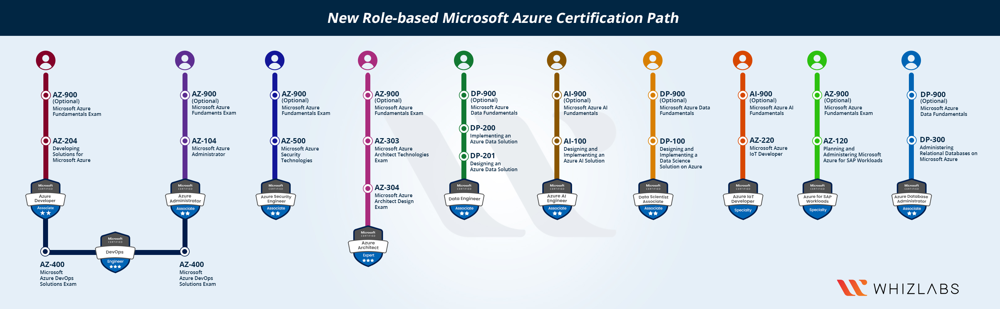

<!-- Created during the 2021 Spring Chillout session -->

# Purpose:
This document was created for WGXC DC members who want to pursue Azure certifications and so that we can share references/experiences that can help others study for the exams. 

We encourage you to add your @handle with references, blog posts or even other resources used during your training. 

## Azure Certifcations available in 2021
[Azure Training Homepage](https://docs.microsoft.com/en-us/learn/certifications/)

Foundational: 
* [Azure Certified Cloud Practitioner](https://docs.microsoft.com/en-us/learn/certifications/azure-fundamentals/)
  * Certification is a general overview of most Azure Resources, and basic principles of cloud infrastructure, and Azure' IAAS (Infrastructure As A Service), PAAS (Platform As A Service), and SAAS (Software As A Service) solutions.

Associate:
* [Azure Developer Associate](https://docs.microsoft.com/en-us/learn/certifications/azure-developer/)
  * This will prepare you to develop cloud native solutions using Azure infrastucture and platforms, as well as provide insight and best practices for migrating legacy apps to the cloud.
* [Azure SysOps Administration Associate](https://Azure.amazon.com/certification/certified-sysops-admin-associate/)
  * This will prepare you to operate an existing Azure environment, and deal with the challenges faced by maintaining highly available and fault tolerant applications.

Professional:
* [Azure DevOps Engineer Professional](https://docs.microsoft.com/learn/certifications/devops-engineer/)
  * Next step from the Developer Associate and Administrator Associate, and will continue to dive further into developing solutions and managing them day to day. Covers using Azure tools to orchestrate Continuous  including [Azure DevOps](https://azure.microsoft.com/en-us/services/devops/).
* [Azure Solutions Architect Expert](https://docs.microsoft.com/learn/certifications/azure-solutions-architect/)
  * This path consolidates what you've learned from the Microsoft Architect Technologies and Architect Design Exams, and will prepare you to build the solutions you've presented to clients. This exam dives deep into the underlying technologies that make up many of Azure Managed solutions like Cosmos DB.

Specialties - These exams slot in somewhere between the associate and professional level, and dig deep into specific technical domains.
* [Security Engineer](https://docs.microsoft.com/en-us/learn/certifications/roles/security-engineer)
  * Prepares you to create secure Azure Organizations, and modify existing environments to have a better security footprint. Focuses also on monitoring and alerting, to deal with security incidents, and prevent them from happening in the first place.
* [Data Engineer](https://docs.microsoft.com/en-us/learn/certifications/azure-data-engineer/)
  * Prepares you to use Azure Big Data tools, and provide ETL, and reporting visualizations. This will cover in depth using SQL, Python or Scala to provide solutions.
* [AI Engineer](https://docs.microsoft.com/en-us/learn/certifications/roles/ai-engineer)
  * Provides training on how to use AI and Machine Learning solutions inside of Azure. Focuses on Data Engineering, Exploratory Data Analysis, Modeling of Data, and implementing Machine Learning Operations. Key services are Azure Cognitive Services, Search and Microsoft Bot Framework.
  
## How can I study for Azure certs?
### 1. [Linux Academy](https://linuxacademy.com/)
### 2. [Whizlabs](https://www.whizlabs.com/microsoft-azure-certification-training-courses/)